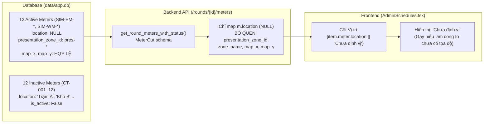

# BÁO CÁO KIỂM TOÁN HIỆN TRẠNG DESKTOP ADMIN UX & DATA CONSISTENCY (V16E - R1)
**Current State Audit: Desktop Admin UX & Data Consistency**

- **Hệ thống**: Dashboard Vận hành Cảng Tân Thuận (*Tan Thuan Port Operations Dashboard*)
- **Phiên bản kiến trúc**: V16E Consolidation — Desktop UX R1
- **Thời điểm kiểm toán**: 20/09/2026
- **Kỹ sư phụ trách**: Senior Product Engineer / UX Architect / Database Analyst
- **Trạng thái commit cơ sở**: `1f0d3eb` (nhánh `feature/v16e-network-map-overlay-r1`)
- **Nhánh backup an toàn**: `backup/pre-v16e-desktop-ux-r1-1f0d3eb`

---

## 1. Tóm tắt phân loại các phát hiện kiểm toán

Báo cáo phân định nghiêm ngặt 5 nhóm phát hiện theo đúng quy chuẩn an toàn:
1. **Confirmed Defect**: Lỗi logic code hoặc mapping hiển thị sai lệch so với nguồn dữ liệu có sẵn.
2. **Expected Behavior**: Hành vi đúng theo thiết kế nghiệp vụ hiện tại nhưng cần làm rõ ngữ cảnh.
3. **Data Limitation**: Giới hạn vốn có của tập dữ liệu mẫu/mô phỏng trong database (không được can thiệp sửa DB).
4. **UX Improvement**: Điểm nghẽn trải nghiệm người dùng, phân cấp thị giác hoặc vị trí nút thao tác nguy hiểm.
5. **Unverified Issue**: Nghi vấn cần loại trừ, không có cơ sở lỗi thực tế.

---

## 2. Kiểm toán A1: Thông tin vị trí công tơ (Meter Location & Zone Data Flow)

### 2.1. Truy vết đường dẫn dữ liệu (Data Pipeline Traceability)
Đường dẫn dữ liệu: `data/app.db` → `backend/app/meter_logbook.py` → `backend/app/schemas.py (MeterOut)` → `frontend/src/services/api.ts` → `frontend/src/components/admin/AdminSchedules.tsx`.

### 2.2. Phân biệt rõ các khái niệm vị trí trong hệ thống
| Khái niệm | Trạng thái thực tế trên 12 công tơ hoạt động (`SIM-EM-*`, `SIM-WM-*`) | Phân loại |
| :--- | :--- | :---: |
| **Tọa độ công tơ (`map_x`, `map_y`)** | **TỒN TẠI ĐẦY ĐỦ** (ví dụ: SIM-EM-001 có `0.7258, 0.6760`; SIM-WM-001 có `0.7363, 0.6882`). Marker hiển thị chuẩn xác trên Bản đồ. | `Confirmed Defect` (bị giấu ở Sổ ca) |
| **Tọa độ xác minh (`verification_status`)** | Đạt `SIMULATION_APPROVED` trong liên kết `MeterAssetRelation`. Chưa qua khảo sát thực địa vật lý (`FIELD_INSPECTION`). | `Expected Behavior` |
| **Phân khu (`presentation_zone_id`)** | **ĐÃ GÁN 100%**: `pres-technical` (Khu kỹ thuật), `pres-berth` (Cầu cảng), `pres-container-west` (Bãi Tây), `pres-container-center` (Bãi Trung tâm), `pres-cfs-east` (Kho CFS). | `Confirmed Defect` (không hiển thị ở Sổ ca) |
| **Liên kết Asset (`MeterAssetRelation`)** | **ĐÃ LIÊN KẾT 100%**: SIM-EM-001 gắn tại `SIM-MDB-01`, SIM-EM-007 gắn tại `SIM-YDB-W01` và đo `SIM-RTG-W01`,... | `Expected Behavior` |
| **Vị trí văn bản (`m.location`)** | Giá trị là `NULL` trong DB. Cột này vốn chỉ được gán text cho 12 công tơ cũ (`CT-001..12`). | `Data Limitation` |

### 2.3. Kết luận & Giải pháp A1
- **Phân loại**: `Confirmed Defect` kết hợp `UX Improvement`.
- **Nguyên nhân gốc**: Schema `MeterOut` trong `backend/app/schemas.py` và hàm `get_round_meters_with_status` trong `backend/app/meter_logbook.py` chỉ serialize cột `m.location` (vốn là `None`). Giao diện `AdminSchedules.tsx` kiểm tra `item.meter.location || 'Chưa định vị'`, khiến 100% công tơ hoạt động hiển thị nhãn `"Chưa định vị"` dù đã có phân khu và tọa độ trên bản đồ.
- **Giải pháp xử lý**:
  1. Cập nhật `MeterOut` và `BatchMeterItem` trong backend để trả về thêm: `zone_name`, `presentation_zone_id`, `presentation_zone_name`, `map_x`, `map_y`, `utility_type`.
  2. Tại giao diện `AdminSchedules.tsx`: Hiển thị tên phân khu (ví dụ: `"Khu kỹ thuật"`, `"Cầu cảng"`, `"Bãi Tây"`) khi `location` là null. Chỉ hiển thị `"Chưa định vị"` khi thực sự thiếu cả tọa độ lẫn phân khu.
  3. Nút `"Bản đồ"`: Khi công tơ có tọa độ (`map_x`, `map_y`), chuyển sang Bản đồ và zoom focus đối tượng. Nếu không có tọa độ, hiển thị thông báo rõ ràng thay vì giả lập vị trí.

---

## 3. Kiểm toán A2: Lịch ghi và Sổ ca (Schedules & Round Meter Logbook)

### 3.1. Phân tích nguyên nhân 24 lượt ghi trong ngày
- **Phân loại**: `Expected Behavior` & `Data Limitation`.
- **Thực tế cơ sở dữ liệu**: Dữ liệu kịch bản chuẩn trong `data/app.db` tạo các lượt ghi `ReadingRound` theo từng giờ chẵn: `00:00`, `01:00`, `02:00`, ..., `23:00` (đủ 24 lượt ghi/ngày).
- **Ánh xạ ca nghiệp vụ chuẩn Cảng Sài Gòn**:
  - **Ca 1 (Ca sáng)**: 06:00 → 14:00 (gồm 8 lượt: 06:00, 07:00, 08:00, 09:00, 10:00, 11:00, 12:00, 13:00).
  - **Ca 2 (Ca chiều)**: 14:00 → 22:00 (gồm 8 lượt: 14:00, 15:00, 16:00, 17:00, 18:00, 19:00, 20:00, 21:00).
  - **Ca 3 (Ca đêm)**: 22:00 → 06:00 sáng hôm sau (gồm 8 lượt: 22:00, 23:00, 00:00, 01:00, 02:00, 03:00, 04:00, 05:00).
- **Ràng buộc**: Data model hiện tại lưu từng `ReadingRound` riêng biệt liên kết tới `ReadingBatch`. Không có bảng phân cấp ca (`Shift`). Do đó, **không được tự ý xóa hoặc gộp 24 bản ghi thành 3 bản ghi trong DB**. Tuy nhiên trên UI Desktop, bảng 24 dòng gây lặp lại thị giác và kéo dài trang quá mức. Cần phân nhóm trực quan theo 3 ca (`Ca 1`, `Ca 2`, `Ca 3`) hoặc làm gọn danh sách để người vận hành dễ định vị.

### 3.2. Cơ chế trạng thái OPEN / CLOSED và Tiến độ 12/12
- **Trạng thái OPEN / CLOSED**: Cột `status` của bảng `reading_rounds`. Được đặt là `"OPEN"` khi tạo và `"CLOSED"` khi kết thúc kỳ đối soát.
- **Tiến độ 12/12**:
  - Mẫu số 12: Tính từ số công tơ `Meter.is_active == True` (chính xác 12 công tơ: 8 điện `SIM-EM-*`, 4 nước `SIM-WM-*`).
  - Tử số: Số bản ghi `MeterReading` trong lượt đó có `status == 'CONFIRMED'`.
- **Nguồn gốc chỉ số**: Lấy trực tiếp từ bảng `meter_readings` qua cặp khóa `(reading_round_id, meter_id)`.

### 3.3. Rủi ro hành động "Xóa toàn bộ lịch ngày"
- **Phân loại**: `Confirmed Defect` (về UI Safety) kết hợp `UX Improvement`.
- **Hành vi backend thực tế (`backend/app/admin.py`)**:
  - Hàm `delete_admin_schedules_by_date(db, actor, date_str, force)`: Nếu `total_readings > 0` và `force == False`, backend sẽ ném lỗi `HTTP 409 Conflict` để bảo vệ dữ liệu.
- **Lỗ hổng trên giao diện hiện tại**:
  - Component `AdminSchedules.tsx` (dòng 475) đang gọi `deleteAdminSchedulesByDate(deleteTarget.date, true)` với cờ `force = true` cố định.
  - Nút `"Xóa toàn bộ lịch ngày"` màu đỏ nằm ngay tại thẻ tiêu đề (`admin-btn-delete-all`), rất dễ bị bấm nhầm.
- **Giải pháp khắc phục**:
  - Đưa nút "Xóa toàn bộ lịch ngày" xuống vị trí thứ cấp (secondary action), không dùng viền đỏ nổi bật mời gọi tương tác phá hủy.
  - Hiển thị rõ số lượng chỉ số sẽ bị xóa và bắt buộc người dùng xác nhận có ý thức.
  - Tôn trọng cờ bảo vệ an toàn của backend.

---

## 4. Kiểm toán A3: Báo cáo Kỹ thuật (Admin Reports & Metrics Traceability)

### 4.1. Ma trận nguồn dữ liệu & Công thức KPI
| Chỉ số KPI | Nguồn dữ liệu | Công thức tính | Hiện trạng hiển thị | Đánh giá kiểm toán |
| :--- | :--- | :--- | :---: | :---: |
| **Lượt đo đến hạn** | `ReadingRound` & `Meter` | `len(due_rounds) * total_meters_count` | 8.088 lượt | `Confirmed Defect`: Backend query `Meter` không lọc `is_active == True`, tính cả 12 công tơ cũ `CT-*` (tổng 24 công tơ). Đúng thực tế chỉ có 12 công tơ hoạt động → mẫu số phải là 4.044 lượt. |
| **Tỷ lệ hoàn tất** | `MeterReading` & `due_slots` | `(total_confirmed / total_due_slots) * 100` | 49.9% | `Confirmed Defect`: Do mẫu số bị tính gấp đôi (8.088), tỷ lệ hoàn tất bị giảm từ 100% xuống 49.9%. |
| **Cần kiểm tra** | `MeterReading` | `count(status == 'REVIEW')` | 0 | `Expected Behavior`: Tháng 9 dữ liệu mô phỏng chuẩn không có bản ghi lỗi. |
| **Can thiệp người dùng** | `MeterReading` | `(user_corrected + manual_entry) / total_confirmed * 100` | 0.0% | `Expected Behavior`: 100% bản ghi tháng 9 là `OCR_CONFIRMED`. |
| **Độ trễ ghi nhận p50/p95** | `MeterReading.server_timestamp` trừ `ReadingRound.scheduled_at` | Phân vị 50% và 95% của mảng chênh lệch (phút) | **0 phút / 0 phút** | `Data Limitation`: Dữ liệu mô phỏng tháng 9 gán `server_timestamp = scheduled_at`, độ trễ toán học = 0.0 phút. Cần hiển thị nhãn giải thích. |
| **Bảng "Công tơ cần theo dõi"** | `MeterReading` theo từng `Meter` | Sắp xếp: `confirmed_count >= 5`, sau đó theo `human_intervention_rate` giảm dần | 8 công tơ với tỷ lệ **0.0%**; Khu vực: **"Chưa phân loại"** | `UX Improvement` & `Data Limitation`: Khi toàn bộ công tơ đều có tỷ lệ can thiệp 0%, bảng hiển thị danh sách gây bối rối cho Admin. Cột Khu vực hiển thị `"Chưa phân loại"` do `m.location` null. |

### 4.2. Giải pháp hoàn thiện cho Báo cáo (B3)
1. **Lọc đúng công tơ hoạt động**: Trong `backend/app/admin_reports.py`, thêm bộ lọc `Meter.is_active == True` và đồng bộ theo kịch bản đang chọn (`scenario_id`) để mẫu số `total_due_slots` phản ánh đúng số công tơ thực tế vận hành.
2. **Khu vực công tơ trong Báo cáo**: Lấy tên phân khu từ `MapVersionZone` hoặc `OperationalZone` thay vì chỉ đọc `m.location` đơn thuần.
3. **Minh bạch hóa dữ liệu mô phỏng**: Thêm badge hoặc chú thích ngữ cảnh: `"Dữ liệu mô phỏng (Baseline Scenario: Độ trễ 0 phút, 100% OCR đạt chuẩn)"` để tránh người dùng hiểu lầm là lỗi hệ thống.

---

## 5. Tổng hợp phân loại & Kế hoạch Phase B

| Vấn đề | Phân loại | Tệp tác động | Phương án Phase B |
| :--- | :---: | :--- | :--- |
| **1. "Chưa định vị" trên công tơ có tọa độ** | `Confirmed Defect` | `backend/app/schemas.py` `backend/app/meter_logbook.py` `frontend/src/components/admin/AdminSchedules.tsx` `frontend/src/types.ts` | Trả về `zone_name`, `presentation_zone_name`, `map_x`, `map_y` từ backend; hiển thị tên phân khu trên giao diện Sổ ca. |
| **2. Nút "Bản đồ" trên Sổ ca** | `UX Improvement` | `frontend/src/components/admin/AdminSchedules.tsx` | Điều hướng sang Bản đồ và focus công tơ khi có tọa độ. |
| **3. Lặp lại thị giác 24 lượt ghi** | `UX Improvement` | `frontend/src/components/admin/AdminSchedules.tsx` `frontend/src/index.css` | Phân nhóm theo 3 Ca chuẩn Cảng Sài Gòn (Ca 1, Ca 2, Ca 3) hoặc làm nổi bật lượt hiện tại/đang chọn; làm gọn giao diện desktop. |
| **4. Nút "Xóa toàn bộ lịch ngày" quá nổi bật** | `Confirmed Defect` (UI Safety) | `frontend/src/components/admin/AdminSchedules.tsx` `frontend/src/index.css` | Chuyển thành nút thứ cấp, cảnh báo chi tiết số bản ghi mất mát, tôn trọng kiểm tra backend. |
| **5. Mẫu số lượt đo đến hạn tính cả công tơ inactive** | `Confirmed Defect` | `backend/app/admin_reports.py` | Lọc `Meter.is_active == True` trong `admin_reports.py` để tính toán chính xác. |
| **6. Vị trí "Chưa phân loại" trong Báo cáo** | `Confirmed Defect` | `backend/app/admin_reports.py` `frontend/src/components/admin/AdminReports.tsx` | Nạp tên phân khu thay thế cho `m.location` null. |
| **7. Độ trễ 0 phút và can thiệp 0%** | `Data Limitation` | `frontend/src/components/admin/AdminReports.tsx` | Giữ nguyên số liệu thực tế; bổ sung nhãn giải thích kịch bản mô phỏng rõ ràng. |

---

*Báo cáo kiểm toán hoàn tất, tuân thủ nghiêm ngặt quy tắc an toàn và sẵn sàng cho việc triển khai Phase B.*
