# BÁO CÁO NGHIỆM THU: TÁI CẤU TRÚC ĐIỀU HƯỚNG 4 WORKSPACE NGHIỆP VỤ (V16E)
**Four-Workspace Product Consolidation Delivery Report**

- **Hệ thống**: Dashboard Vận hành Cảng Tân Thuận (Tan Thuan Port Operations)
- **Phiên bản kiến trúc**: V16E Consolidation
- **Trạng thái nghiệm thu**: `FOUR_WORKSPACES_READY_FOR_HUMAN_REVIEW`
- **Thời điểm hoàn thành**: 20/09/2026
- **Kỹ sư phụ trách**: Senior Product Engineer / UX Architect / Database Analyst

---

## 1. Tóm tắt điều hành (Executive Summary)

Dự án tái cấu trúc Information Architecture (IA) V16E đã hoàn thành việc hợp nhất toàn bộ nghiệp vụ quản lý năng lượng và đo đếm của Cảng Tân Thuận vào **đúng 4 workspace nghiệp vụ cấp cao duy nhất**:

1. **Bản đồ** (`dashboard` / `map`): Giám sát không gian trực quan, mạng lưới phân phối điện/nước và định vị hạ tầng.
2. **Lịch ghi** (`schedules`): Lập lịch ca đo, phân công tuyến đọc và tích hợp trực tiếp **Sổ ca ghi chỉ số (Round Meter Logbook)** ngay trong ngữ cảnh ca đo.
3. **Phân ca** (`staff_roster`): Điều phối nhân sự vận hành, phân quyền tài khoản và theo dõi ca trực.
4. **Báo cáo** (`reports`): Trung tâm phân tích sản lượng điện nước, kiểm soát tổn thất, đối soát dữ liệu và tích hợp **Nhật ký kiểm toán hệ thống (Audit Log)** tại Tab 5.

### Cam kết an toàn & Bất biến hệ thống
- **Tuyệt đối không có mục điều hướng cấp cao thứ 5**: Toàn bộ Desktop Rail (80px) và Mobile Drawer chỉ hiển thị đúng 4 biểu tượng/mục điều hướng.
- **Loại bỏ hoàn toàn menu phụ `[⋯]` trên Desktop Rail**: Không còn popover phụ gây phân mảnh hoặc ẩn giấu chức năng.
- **Bảo toàn 100% cơ sở dữ liệu**: Tệp `data/app.db` không bị thay đổi cấu trúc bảng (schema), không thêm migration và không phát sinh rủi ro mất mát dữ liệu sản xuất.
- **Hệ thống kiểm thử tự động đạt 100%**: 249/249 frontend tests pass, 14/14 backend admin operations tests pass, 0 lỗi TypeScript compile (`tsc --noEmit`).

---

## 2. Chi tiết hợp nhất 4 Workspace Nghiệp vụ

```mermaid
flowchart TD
    subgraph Navigation ["Hệ Thống Điều Hướng 4 Workspace"]
        W1["1. Bản đồ (Map Operations)"]
        W2["2. Lịch ghi (Schedules & Logbook)"]
        W3["3. Phân ca (Staff Roster)"]
        W4["4. Báo cáo (Reports & Audit)"]
    end

    subgraph W1_Details ["Chi tiết Workspace 1: Bản đồ"]
        W1 --> W1_A["Bản đồ vệ tinh & vector 6 phân vùng"]
        W1 --> W1_B["Mạng lưới phân phối điện & nước"]
        W1 --> W1_C["AdaptiveCommandBar: Tìm kiếm nhanh thiết bị"]
        W1 --> W1_D["Hạ tầng chưa tọa độ: SIM-EXT-GRID, SIM-CITY-WATER"]
    end

    subgraph W2_Details ["Chi tiết Workspace 2: Lịch ghi"]
        W2 --> W2_A["Timeline ca đo theo ngày"]
        W2 --> W2_B["Tích hợp Sổ ca ghi (Round Meter Logbook)"]
        W2 --> W2_C["Lọc trạng thái: Đã xác nhận / Cần kiểm tra"]
        W2 --> W2_D["Nút hành động: Định vị bản đồ / Kiểm tra chỉ số"]
    end

    subgraph W3_Details ["Chi tiết Workspace 3: Phân ca"]
        W3 --> W3_A["Danh sách nhân viên đo đạc"]
        W3 --> W3_B["Phân quyền vai trò: Admin / Operator / Supervisor"]
        W3 --> W3_C["Quản lý trạng thái kích hoạt tài khoản"]
    end

    subgraph W4_Details ["Chi tiết Workspace 4: Báo cáo"]
        W4 --> W4_1["Tab 1: Tổng quan tiêu thụ"]
        W4 --> W4_2["Tab 2: Sản lượng Điện"]
        W4 --> W4_3["Tab 3: Sản lượng Nước"]
        W4 --> W4_4["Tab 4: Bất thường & Tổn thất"]
        W4 --> W4_5["Tab 5: Nhật ký kiểm toán (Audit Log tích hợp)"]
    end
```



### 2.1. Workspace 1: Bản đồ (`dashboard`)
- **Vị trí**: Tab 1 trên thanh điều hướng chính.
- **Giải quyết thiết bị chưa có tọa độ**: Các nút nguồn hạ tầng ngoài ranh bản đồ (`SIM-EXT-GRID`, `SIM-CITY-WATER`) không còn bị bỏ rơi hay cần tab riêng. Chúng được nạp trực tiếp vào thanh lệnh thích ứng (`AdaptiveCommandBar`). Khi người dùng tìm kiếm, thiết bị được gắn nhãn nhận diện `"Chưa định vị"` rõ ràng, bấm vào sẽ hiển thị đầy đủ thông số kỹ thuật và đồng hồ liên kết trong ngăn ngữ cảnh bên phải mà không làm lệch tâm bản đồ.

### 2.2. Workspace 2: Lịch ghi (`schedules`)
- **Vị trí**: Tab 2 trên thanh điều hướng chính.
- **Tích hợp Sổ ca ghi (Round Meter Logbook) tại chỗ**:
  - Không phân tách thành màn hình "Sổ ca" hay "Danh sách đồng hồ" rời rạc.
  - Khi người vận hành chọn một ca đo bất kỳ trên timeline hoặc bấm nút `"Sổ ca"` tại hàng ca đo, bảng danh sách đồng hồ thuộc ca đo đó lập tức mở ra ngay phía dưới.
  - Hỗ trợ tìm kiếm theo mã/tên đồng hồ, lọc theo loại dịch vụ (Điện/Nước) và trạng thái (Đã ghi/Cần kiểm tra).
  - Tích hợp 2 nút hành động liền mạch:
    1. **Bản đồ** (`locateOnMap`): Chuyển trực tiếp sang Workspace Bản đồ, tự động zoom và highlight đồng hồ tương ứng.
    2. **Kiểm tra** (`openReadingInspection`): Mở drawer kiểm tra chỉ số và ảnh chụp công tơ đối với các bản ghi có cảnh báo bất thường (`REVIEW_REQUIRED`).

### 2.3. Workspace 3: Phân ca (`staff_roster`)
- **Vị trí**: Tab 3 trên thanh điều hướng chính.
- **Chức năng**: Quản lý hồ sơ nhân viên, phân công ca trực theo ngày/tuần, cấu hình vai trò quản trị/vận hành, bảo toàn đầy đủ các chức năng hiện hữu.

### 2.4. Workspace 4: Báo cáo (`reports`)
- **Vị trí**: Tab 4 trên thanh điều hướng chính.
- **Hợp nhất Nhật ký kiểm toán (System Audit Log)**:
  - Tích hợp thành **Tab thứ 5 ("Nhật ký kiểm toán")** bên trong Workspace Báo cáo, thay thế việc tạo thêm 1 tab cấp cao bên ngoài.
  - Giữ nguyên toàn bộ năng lực điều tra an toàn hệ thống: bộ lọc người thao tác (Actor), loại thao tác (Action), khoảng thời gian, phân trang và xem chi tiết payload JSON diff.
  - Thanh công cụ lọc ngày của Báo cáo được tự động ẩn khi chuyển sang tab Nhật ký kiểm toán để nhường không gian tối đa cho bộ lọc kiểm toán chuyên dụng.

---

## 3. Bằng chứng kiểm tra trực quan (Visual QA Evidence)

Tất cả các hình ảnh bằng chứng dưới đây đã được chụp tự động bằng headless browser trên môi trường thực tế và lưu trữ tại thư mục `docs/product/four-workspaces/evidence/`.

> [!IMPORTANT]
> **Nhãn kiểm định trực quan**: `HUMAN_REVIEW_REQUIRED`
> Các hình ảnh phản ánh chính xác trạng thái giao diện đã được triển khai và sẵn sàng để Product Owner duyệt giao diện.

### 3.1. Môi trường Desktop (1920 × 1080)
| Tên kiểm thử & Mô tả | Ảnh bằng chứng | Trạng thái |
| :--- | :--- | :---: |
| **Workspace 1: Bản đồ**<br>Desktop Rail 80px hiển thị đúng 4 biểu tượng. Không có nút `[⋯]`. Lớp bản đồ và hạ tầng cảng hoạt động bình thường. | [Xem ảnh `01-desktop-workspace-dashboard.png`](file:///D:/Projects/production-meter-reading/production-meter-reading/docs/product/four-workspaces/evidence/01-desktop-workspace-dashboard.png) | `HUMAN_REVIEW_REQUIRED` |
| **Workspace 2: Lịch ghi - Timeline ca đo**<br>Lịch biểu ca đo ngày 15/09/2026 với các ca sáng/chiều, nút "Sổ ca" trực quan. | [Xem ảnh `02a-desktop-workspace-schedules-timeline.png`](file:///D:/Projects/production-meter-reading/production-meter-reading/docs/product/four-workspaces/evidence/02a-desktop-workspace-schedules-timeline.png) | `HUMAN_REVIEW_REQUIRED` |
| **Workspace 2: Sổ ca ghi tích hợp tại chỗ**<br>Bảng chi tiết 12 đồng hồ trong ca đo với đầy đủ chỉ số, trạng thái và nút hành động "Bản đồ", "Kiểm tra". | [Xem ảnh `02-desktop-workspace-schedules-logbook.png`](file:///D:/Projects/production-meter-reading/production-meter-reading/docs/product/four-workspaces/evidence/02-desktop-workspace-schedules-logbook.png) | `HUMAN_REVIEW_REQUIRED` |
| **Workspace 3: Phân ca**<br>Bảng điều phối nhân sự, vai trò, số điện thoại và trạng thái tài khoản. | [Xem ảnh `03-desktop-workspace-staff-roster.png`](file:///D:/Projects/production-meter-reading/production-meter-reading/docs/product/four-workspaces/evidence/03-desktop-workspace-staff-roster.png) | `HUMAN_REVIEW_REQUIRED` |
| **Workspace 4: Báo cáo - Tổng quan**<br>Thống kê sản lượng điện, nước và 5 sub-tabs rõ ràng. | [Xem ảnh `04-desktop-workspace-reports-overview.png`](file:///D:/Projects/production-meter-reading/production-meter-reading/docs/product/four-workspaces/evidence/04-desktop-workspace-reports-overview.png) | `HUMAN_REVIEW_REQUIRED` |
| **Workspace 4: Báo cáo - Nhật ký kiểm toán**<br>Sub-tab 5 tích hợp đầy đủ bảng nhật ký kiểm toán hệ thống. | [Xem ảnh `05-desktop-workspace-reports-audit.png`](file:///D:/Projects/production-meter-reading/production-meter-reading/docs/product/four-workspaces/evidence/05-desktop-workspace-reports-audit.png) | `HUMAN_REVIEW_REQUIRED` |

### 3.2. Môi trường Laptop (1366 × 768)
| Tên kiểm thử & Mô tả | Ảnh bằng chứng | Trạng thái |
| :--- | :--- | :---: |
| **Laptop: Bản đồ**<br>Hiển thị cân đối trên màn hình laptop độ phân giải phổ biến, không vỡ layout. | [Xem ảnh `06-laptop-workspace-dashboard.png`](file:///D:/Projects/production-meter-reading/production-meter-reading/docs/product/four-workspaces/evidence/06-laptop-workspace-dashboard.png) | `HUMAN_REVIEW_REQUIRED` |
| **Laptop: Sổ ca ghi chỉ số**<br>Bảng sổ ca cuộn mượt mà, các nút bấm vừa vặn trong tầm mắt. | [Xem ảnh `07-laptop-workspace-schedules-logbook.png`](file:///D:/Projects/production-meter-reading/production-meter-reading/docs/product/four-workspaces/evidence/07-laptop-workspace-schedules-logbook.png) | `HUMAN_REVIEW_REQUIRED` |

### 3.3. Môi trường Di động (Mobile 390 × 844)
| Tên kiểm thử & Mô tả | Ảnh bằng chứng | Trạng thái |
| :--- | :--- | :---: |
| **Mobile: Bản đồ trực quan**<br>Giao diện thu gọn tối ưu cho thao tác một tay của giám sát viên hiện trường. | [Xem ảnh `08-mobile-workspace-dashboard.png`](file:///D:/Projects/production-meter-reading/production-meter-reading/docs/product/four-workspaces/evidence/08-mobile-workspace-dashboard.png) | `HUMAN_REVIEW_REQUIRED` |
| **Mobile: Navigation Drawer**<br>Menu trượt bên trái hiển thị chính xác và duy nhất 4 mục điều hướng: Bản đồ, Lịch ghi, Phân ca, Báo cáo. | [Xem ảnh `09-mobile-navigation-drawer.png`](file:///D:/Projects/production-meter-reading/production-meter-reading/docs/product/four-workspaces/evidence/09-mobile-navigation-drawer.png) | `HUMAN_REVIEW_REQUIRED` |
| **Mobile: Lịch ghi ca đo**<br>Danh sách ca đo tối ưu cảm ứng, hiển thị đầy đủ thông tin nhân sự và tiến độ. | [Xem ảnh `10-mobile-workspace-schedules.png`](file:///D:/Projects/production-meter-reading/production-meter-reading/docs/product/four-workspaces/evidence/10-mobile-workspace-schedules.png) | `HUMAN_REVIEW_REQUIRED` |

---

## 4. Kết quả kiểm thử kỹ thuật (Automated Verification)

```
========================= TỔNG KẾT KIỂM THỬ KỸ THUẬT =========================
1. Frontend Test Suite (Node.js Test Runner / Vitest / JSDOM):
   - Tổng số test: 249
   - Đạt (PASS): 249 (100%)
   - Thất bại (FAIL): 0
   - Thời gian thực thi: 1.51s

2. Backend Admin Operations Test Suite (pytest tests/test_admin_operations.py):
   - Tổng số test: 14
   - Đạt (PASS): 14 (100%)
   - Thất bại (FAIL): 0
   - Thời gian thực thi: 8.56s

3. TypeScript Compiler Typecheck (npx tsc --noEmit):
   - Trạng thái: PASS (Exit code 0)
   - Lỗi phát sinh: 0 lỗi

4. Tính toàn vẹn Cơ sở dữ liệu:
   - File data/app.db: Không bị chỉnh sửa schema, không thêm migration
   - Checksum schema: Khớp 100% với baseline trước khi thực hiện
================================================================================
```

---

## 5. Danh mục tài liệu kỹ thuật đính kèm

Bộ hồ sơ kiến trúc đầy đủ của đợt tái cấu trúc V16E được lưu trữ tại `docs/product/four-workspaces/`:

1. [`01_CURRENT_STATE_AUDIT.md`](file:///D:/Projects/production-meter-reading/production-meter-reading/docs/product/four-workspaces/01_CURRENT_STATE_AUDIT.md): Kiểm toán toàn diện hiện trạng điều hướng, bảng DB và các điểm xung đột UI trước khi triển khai.
2. [`02_UI_API_DB_TRACEABILITY.md`](file:///D:/Projects/production-meter-reading/production-meter-reading/docs/product/four-workspaces/02_UI_API_DB_TRACEABILITY.md): Ma trận truy vết chi tiết từng component UI, API endpoint và bảng cơ sở dữ liệu về đúng 4 workspace.
3. [`03_RISK_REGISTER.md`](file:///D:/Projects/production-meter-reading/production-meter-reading/docs/product/four-workspaces/03_RISK_REGISTER.md): Đăng ký rủi ro, phân loại mức độ tác động và phương án rollback dự phòng.
4. [`04_TARGET_INFORMATION_ARCHITECTURE.md`](file:///D:/Projects/production-meter-reading/production-meter-reading/docs/product/four-workspaces/04_TARGET_INFORMATION_ARCHITECTURE.md): Quy chuẩn kiến trúc thông tin mục tiêu, cấu trúc thanh ray Desktop Rail và Mobile Drawer.
5. [`05_WORKFLOW_MIGRATION_MATRIX.md`](file:///D:/Projects/production-meter-reading/production-meter-reading/docs/product/four-workspaces/05_WORKFLOW_MIGRATION_MATRIX.md): Ma trận ánh xạ chuyển đổi các luồng thao tác cũ sang quy trình mới.
6. [`06_NAVIGATION_AND_DEEPLINK_CONTRACT.md`](file:///D:/Projects/production-meter-reading/production-meter-reading/docs/product/four-workspaces/06_NAVIGATION_AND_DEEPLINK_CONTRACT.md): Hợp đồng định tuyến URL, tham số query deep-link và các bất biến kiểm thử.
7. [`07_FOUR_WORKSPACES_DELIVERY_REPORT.md`](file:///D:/Projects/production-meter-reading/production-meter-reading/docs/product/four-workspaces/07_FOUR_WORKSPACES_DELIVERY_REPORT.md): Báo cáo tổng kết và nghiệm thu chính thức (tài liệu này).

---

## 6. Kết luận & Khuyến nghị

Đợt tái cấu trúc V16E đã đạt được trọn vẹn mục tiêu kiến trúc đề ra:
- Tối giản hóa triệt để giao diện vận hành về 4 trọng tâm nghiệp vụ cốt lõi.
- Chấm dứt tình trạng phân mảnh tính năng và loại bỏ hoàn toàn menu phụ.
- Đảm bảo an toàn kỹ thuật cao nhất: không đụng chạm database, vượt qua 100% bài kiểm tra hồi quy.
- Sẵn sàng bàn giao cho người dùng và các bên liên quan đánh giá thực tế.
