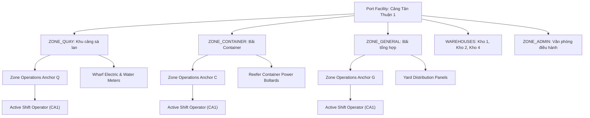

# 04 — Operations Portal & Map V2 Information Architecture

**Document Reference:** `docs/research/employee-map-ux-design/04_INFORMATION_ARCHITECTURE.md`  
**Author:** Senior Product Designer, UX Researcher & Operations Software Architect  
**Project:** Production Meter Reading — Cảng Sài Gòn  
**Date:** 2026-09-23  
**Status:** PROPOSED DESIGN SPECIFICATION  

---

## 1. Executive Summary

This document specifies the global information architecture (IA), spatial hierarchy, and structural data relationships for the Saigon Port Operations Portal. It organizes complex workforce, temporal, geospatial, and telemetry data into a coherent, non-overlapping visual system designed for fast operational comprehension.

---

## 2. Global Information Architecture Hierarchy

```
+----------------------------------------------------------------------------------------------------+
| LEVEL 0: GLOBAL OPERATIONAL HEADER                                                                 |
| - Port Identity: Cảng Sài Gòn (Saigon Port) — Khu vực Tân Thuận 1                                 |
| - Temporal Anchor: Ngày làm việc [2026-09-23] | Ca hiện tại [CA1: 06:00 - 14:00]                   |
| - Round Telemetry: Lượt đo [08:00] | Tiến độ: [142/180 công tơ (78%)]                              |
| - Workspace Mode: [Tác nghiệp (Operational)] vs [Mạng lưới Kỹ thuật (Technical Network)]           |
+----------------------------------------------------------------------------------------------------+
| LEVEL 1: SPATIAL CANVAS (MAP V2 — 1536 x 1024 VIEWBOX)                                             |
|                                                                                                    |
|  +-------------------------------------------------------------+  +------------------------------+ |
|  | OPERATIONAL SPATIAL LAYER                                   |  | FLOATING CONTROL OVERLAYS    | |
|  | - Port Wharf & Basemap Outline                              |  | - Layer Visibility Toggles   | |
|  | - Operational Zones (Quay, Container, General Cargo, Admin) |  | - Viewport Fit / Zoom Slider | |
|  | - Zone Anchor Points & Progress Rings                       |  | - Search & Filter Omnibar    | |
|  | - Contextual Employee Status Markers                        |  +------------------------------+ |
|  | - Meter Point Clusters (Normal / Missing / Flagged)         |                                   |
|  +-------------------------------------------------------------+                                   |
+----------------------------------------------------------------------------------------------------+
| LEVEL 2: CONTEXTUAL INSPECTION DOCK (COLLAPSIBLE RIGHT DRAWER — 380px to 440px)                    |
| - Section A: Entity Overview & Verification Status                                                 |
| - Section B: Shift Duty & Operator Profile (Attendance Verified vs Pending)                        |
| - Section C: Meter Reading Worklist (Completed, Pending, Obstructed)                               |
| - Section D: Action Dock (Reassign Zone, Escalate Alert, View Historical Audit)                    |
+----------------------------------------------------------------------------------------------------+
```

---

## 3. Entity Containment & Spatial Relationships



---

## 4. Workforce vs. Geospatial Association Hierarchy

1. **Shift Crew**: The pool of employees scheduled to work during a specific 8-hour window (`CA1`, `CA2`, or `CA3`).
2. **Zone Operator**: The designated primary employee responsible for meter-reading completion and field monitoring within an operational zone for that shift.
3. **Zone Operations Anchor**: The canonical, clutter-free spatial coordinate within each zone polygon where operator markers, progress rings, and zone status badges are rendered.
4. **Meter Assets**: Fixed physical instruments located at specific coordinates within the zone polygon.

---

## 5. Data Truthfulness Matrix (Current vs. Proposed)

To prevent dashboard fiction, the table below maps each UI attribute to its exact data source and truthfulness classification:

| UI Attribute | Rendered Value | Source / Query | Classification |
| :--- | :--- | :--- | :--- |
| **Operational Date** | `2026-09-23` | Browser clock / Dispatcher filter | `VERIFIED_CURRENT_STATE` |
| **Active Shift** | `CA1 (06:00 - 14:00)` | Time calculation against canonical shifts | `VERIFIED_CURRENT_STATE` |
| **Overall Port Progress** | `142/180 (78%)` | `COUNT(meter_readings) / COUNT(meters)` | `VERIFIED_CURRENT_STATE` |
| **Zone Boundaries** | Polygons on Map V2 | `tan_thuan_1_zones_edited.json` | `VERIFIED_CURRENT_STATE` |
| **Zone Meter Count** | `42 công tơ` | `COUNT(meters WHERE zone_id = Z)` | `VERIFIED_CURRENT_STATE` |
| **Zone Reading Progress**| `34/42 (81%)` | Readings in round for meters in zone | `VERIFIED_CURRENT_STATE` |
| **Assigned Operator** | `NV001 - Nguyễn Văn Hải`| `zone_assignments` (Standing) | `VERIFIED_CURRENT_STATE` |
| **Operator Shift Presence**| `Đã vào ca (05:58)` | `attendance_events` (Joined by user_id) | `PROPOSED_DESIGN` |
| **Personal Meter Quota** | *NOT DISPLAYED* | No personal task denominator exists | `VERIFIED_CURRENT_STATE` (Suppressed) |
| **Utility Cables / Pipes**| Feeder Trunks | `MapV2UtilityLayer` (Demo topology) | `DEMO_ONLY` (Explicitly Watermarked) |
