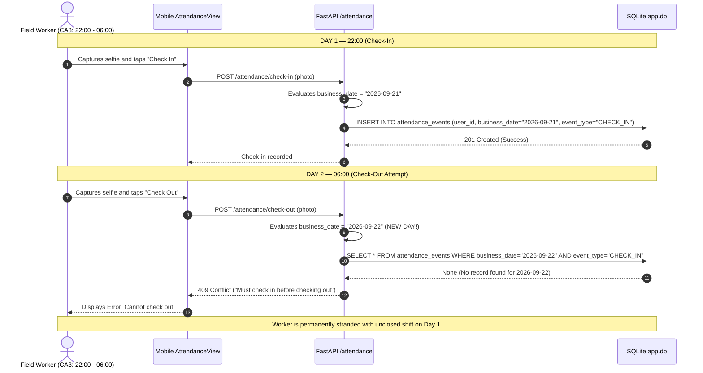
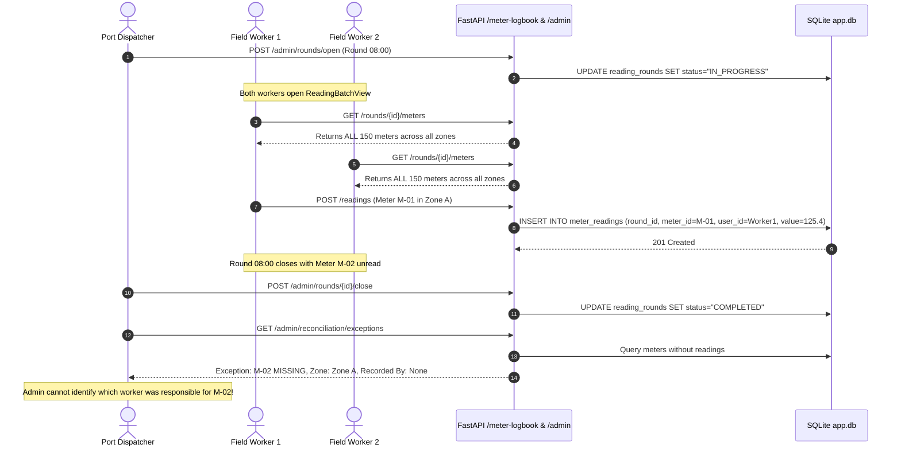

# 08 — Current-State Entity-Relationship & Operational Flow Diagrams

**Document Reference:** `docs/research/employee-shift-map-audit/08_CURRENT_STATE_RELATIONSHIPS.md`  
**Audit Date:** 2026-09-23  
**Auditor Role:** Senior Business Analyst, Software Architect, Database Auditor & Full-Stack Engineer  
**Audit Mode:** Read-Only Source & Architecture Audit  

---

## 1. Executive Summary

This document provides formal architectural models of the current system state, including a comprehensive Entity-Relationship Diagram (ERD) of all SQLite tables and operational sequence diagrams of existing workflows.

Crucially, **missing relationships are explicitly highlighted** in the diagrams to provide an indisputable architectural basis for future target-state engineering.

---

## 2. Current-State Entity-Relationship Diagram (ERD)

The diagram below reflects the exact schema defined in [`backend/app/models.py`](file:///D:/Projects/production-meter-reading/production-meter-reading/backend/app/models.py) and enforced in `app.db`. Red dashed lines indicate critical missing foreign keys identified during this audit.

```mermaid
erDiagram
    users ||--o{ work_schedules : "has scheduled shifts (CASCADE)"
    users ||--o{ leave_requests : "requests leave (CASCADE)"
    users ||--o{ leave_requests : "nominated as substitute (SET NULL)"
    users ||--o{ leave_requests : "reviewed by admin (SET NULL)"
    users ||--o{ attendance_events : "submits attendance (CASCADE)"
    users ||--o{ zone_assignments : "assigned to zone (CASCADE)"
    users ||--o{ meter_readings : "records reading (RESTRICT)"

    operational_zones ||--o{ zone_assignments : "governs zone (CASCADE)"
    operational_zones ||--o{ meters : "contains meters (RESTRICT)"

    reading_batches ||--o{ reading_rounds : "subdivides into rounds (CASCADE)"
    reading_rounds ||--o{ meter_readings : "aggregates readings (CASCADE)"
    meters ||--o{ meter_readings : "is read during round (CASCADE)"

    %% =========================================================================
    %% ENTITY DEFINITIONS WITH CONSTRAINTS
    %% =========================================================================

    users {
        int id PK
        varchar employee_code UK
        varchar full_name
        varchar password_hash
        varchar role "EMPLOYEE | ADMIN"
        boolean is_active
        datetime created_at
    }

    work_schedules {
        int id PK
        int user_id FK
        varchar work_date "YYYY-MM-DD"
        varchar shift_code "CA1 | CA2 | CA3 | HC | OFF | LEAVE"
        varchar status "SCHEDULED | COMPLETED | ABSENT | ON_LEAVE"
        text notes
        %% CONSTRAINT uq_user_work_date UNIQUE(user_id, work_date)
    }

    leave_requests {
        int id PK
        int user_id FK
        varchar start_date "YYYY-MM-DD"
        varchar end_date "YYYY-MM-DD"
        text reason
        int substitute_user_id FK
        varchar status "PENDING | APPROVED | REJECTED"
        int reviewed_by FK
        datetime reviewed_at
    }

    attendance_events {
        int id PK
        int user_id FK
        varchar business_date "YYYY-MM-DD"
        varchar event_type "CHECK_IN | CHECK_OUT"
        datetime server_timestamp
        datetime device_timestamp
        varchar photo_key
        varchar status "VALID | REJECTED"
        float location_lat
        float location_lng
        text notes
        %% CONSTRAINT uq_user_date_event UNIQUE(user_id, business_date, event_type)
    }

    operational_zones {
        int id PK
        varchar code UK "e.g. ZONE_A"
        varchar name
        text polygon_coordinates "JSON [[x,y],...]"
        varchar color
        boolean is_active
    }

    zone_assignments {
        int id PK
        int user_id FK
        int zone_id FK
        varchar role "PRIMARY | BACKUP"
        datetime effective_from
        datetime effective_to
        boolean is_active
        %% NOTE: Continuous standing assignment. Not shift-specific.
    }

    meters {
        int id PK
        varchar code UK
        varchar name
        int zone_id FK
        varchar zone_code "Denormalized"
        float map_x "V1 Coordinate Space (1915x821)"
        float map_y "V1 Coordinate Space (1915x821)"
        boolean is_active
    }

    reading_batches {
        int id PK
        varchar code "e.g. 2026-08"
        varchar start_date
        varchar end_date
        varchar status "OPEN | CLOSED"
    }

    reading_rounds {
        int id PK
        int batch_id FK
        varchar round_time "08:00 | 14:00"
        varchar scheduled_date "YYYY-MM-DD"
        varchar status "PENDING | IN_PROGRESS | COMPLETED | OVERDUE"
    }

    meter_readings {
        int id PK
        int round_id FK
        int meter_id FK
        int user_id FK "Recorder Provenance"
        float reading_value
        varchar photo_url
        datetime recorded_at
        varchar status "PENDING | CONFIRMED | FLAGGED"
        varchar exception_state "NORMAL | MISSING"
        %% CONSTRAINT uq_round_meter UNIQUE(round_id, meter_id)
    }
```



---

## 3. Explicit Missing Architectural Relationships

The audit verified five major structural relationship voids in the current SQLite schema:

```
+-----------------------------------------------------------------------------------+
|                           IDENTIFIED RELATIONSHIP VOIDS                           |
+-----------------------------------------------------------------------------------+
| 1. AttendanceEvent -X-> WorkSchedule                                              |
|    - Attendance is logged to a bare calendar string, not a scheduled shift.       |
|    - Cannot determine shift tardiness, early departure, or shift duration.        |
|    - Causes CA3 overnight check-out 409 Conflict crash across midnight.          |
+-----------------------------------------------------------------------------------+
| 2. AttendanceEvent -X-> OperationalZone                                           |
|    - Attendance has no concept of port physical or operational zone check-in.     |
|    - GPS coordinates exist but are not validated against zone polygons.           |
+-----------------------------------------------------------------------------------+
| 3. ZoneAssignment -X-> WorkSchedule                                               |
|    - Zone assignments are permanent/standing, completely ignorant of shifts.      |
|    - An employee cannot be assigned to Zone A for Ca 1 and Zone B for Ca 2.       |
|    - Map V1 synthesizes a fake shift based on round time to compensate for this.  |
+-----------------------------------------------------------------------------------+
| 4. Meter / ReadingRound -X-> ReadingTask (User Assignment)                        |
|    - No table connects a specific meter or reading round to an assigned worker.   |
|    - All field readings are pulled from a shared free-for-all pool.               |
|    - Unread meters at round close have recorded_by=None (zero accountability).    |
+-----------------------------------------------------------------------------------+
| 5. Map V2 Digital Twin -X-> SQLite Database                                       |
|    - Map V2 workspace makes ZERO backend API calls.                               |
|    - Completely disconnected from operational_zones, zone_assignments, & meters.  |
+-----------------------------------------------------------------------------------+
```

---

## 4. Current-State Operational Sequence Diagrams

### 4.1 Attendance Flow & The Overnight (CA3) Failure Loop



---

### 4.2 Meter Reading Pool & Unfinished Work Void


