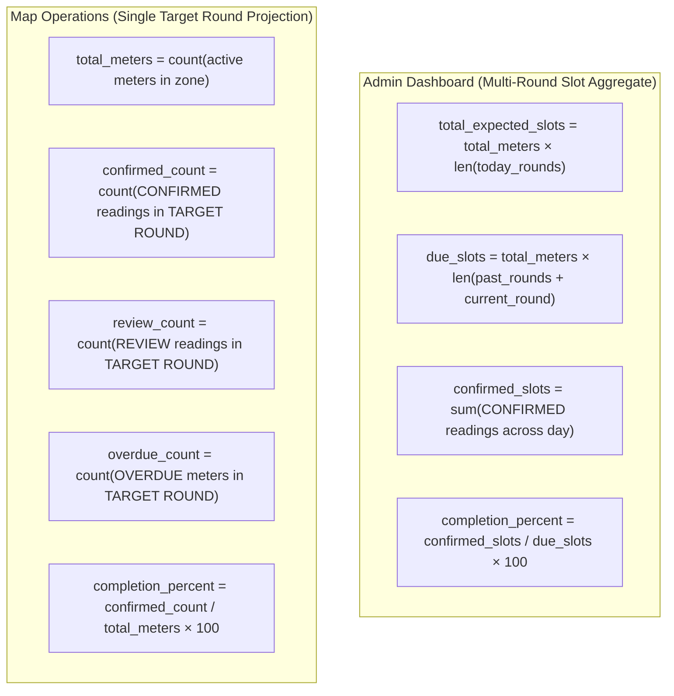

# Map V2 Final Architecture Reconciliation — 06. Zone Hierarchy & Progress Denominator Audit

**Thread:** 6 — Map V2 Final Architecture Reconciliation  
**Hard Gate:** Do not approve UI progress displays (e.g. `34 / 42` or `81%`) until numerator and denominator formulas are mathematically and operationally defined.

---

## 1. Progress Denominator Audit: Dashboard vs. Map V2

A critical discovery of Thread 6 is that the codebase contains **two different progress formulas**, each serving a different operational purpose:



### Backend Code Verification

In [`backend/app/map_operations.py#L296-L302`](file:///D:/Projects/production-meter-reading/production-meter-reading/backend/app/map_operations.py#L296):
```python
for z in zones:
    z_m = zone_metrics.get(z.id, {"total": 0, "confirmed": 0, "review": 0, "overdue": 0, "due": 0, "pending": 0})
    total_m = z_m["total"]
    conf_m = z_m["confirmed"]
    pct = round((conf_m / total_m * 100), 1) if total_m > 0 else 0.0
```

### Mathematical Definitions for Map V2

For any selected round $R$ (e.g. 10:00 Round) and zone $Z$:
- **Numerator**: Number of active meters in zone $Z$ that have reached status `CONFIRMED` in round $R$.
- **Denominator**: Total count of active meters physically assigned to zone $Z$ (`m.is_active == True` and `m.lifecycle_status == 'ACTIVE'`).
- **Percentage**: $\frac{\text{Confirmed Meters in Target Round}}{\text{Total Active Meters in Zone}} \times 100$.

### Mandatory Map UI Labeling Standard
Because Map V2 displays the state of a **single operational round**, generic labels like "34 / 42 công tơ" are ambiguous (users may assume 34 meters exist out of 42 in the port).

| Permitted Label | Prohibited Label | Reason |
| :--- | :--- | :--- |
| **"Đã ghi 34 / 42 công tơ trong lượt"** | "34 / 42 công tơ" | Clarifies that 34 readings were confirmed for the 42 meters in this round. |
| **"Tiến độ lượt: 81%"** | "Tiến độ: 81%" | Distinguishes single-round completion from all-day cumulative completion. |
| **"Chưa mở lượt đọc"** | "0% hoàn thành" | When round is upcoming or unopened, 0% implies operator failure. |

---

## 2. Presentation Containment vs. Operational Aggregation

Thread 5 observed visually nested polygons in presentation geometry:
```text
ZONE_GENERAL (Bãi tổng hợp)
├── BLDG_KHO_1 (Kho 1)
└── BLDG_KHO_2 (Kho 2)
```

We investigated whether visual containment translates into database KPI aggregation.

### 8-Question Hierarchy Trace

| # | Architectural Question | Verified Fact | Source Evidence |
| :-: | :--- | :--- | :--- |
| 1 | Does geometry contain `parent_id`? | **YES**. `BLDG_KHO_1` and `BLDG_KHO_2` have `"parent_id": "ZONE_GENERAL"`. | [`tan_thuan_1_zones_edited.json#L969`](file:///D:/Projects/production-meter-reading/production-meter-reading/frontend/src/components/map-v2/data/tan_thuan_1_zones_edited.json#L969) |
| 2 | Does backend `OperationalZone` contain `parent_id`? | **NO**. `operational_zones` table has no `parent_id` column. It is completely flat. | [`models.py#L89-L103`](file:///D:/Projects/production-meter-reading/production-meter-reading/backend/app/models.py#L89) |
| 3 | Does `MapVersionZone` encode hierarchy? | **NO**. `map_version_zones` has no `parent_id`. All published zones are peers. | [`models.py#L148-L171`](file:///D:/Projects/production-meter-reading/production-meter-reading/backend/app/models.py#L148) |
| 4 | How are meters assigned to zones? | **Scalar foreign key**. `Meter.zone_id` references a single `operational_zones.id`. | [`models.py#L181`](file:///D:/Projects/production-meter-reading/production-meter-reading/backend/app/models.py#L181) |
| 5 | Can one meter belong to multiple operational zones? | **NO**. Relational foreign key constraint enforces strictly 1 zone per meter. | [`models.py#L181`](file:///D:/Projects/production-meter-reading/production-meter-reading/backend/app/models.py#L181) |
| 6 | What denominator does zone completion use? | Count of active meters where `m.zone_id == z.id`. | [`map_operations.py#L250-L263`](file:///D:/Projects/production-meter-reading/production-meter-reading/backend/app/map_operations.py#L250) |
| 7 | Would aggregation of `ZONE_GENERAL` + `KHO_1` + `KHO_2` double count? | **Risk of semantic confusion**: If meters in Kho 1 are assigned to Kho 1, summing them into Zone General double counts the warehouse within the yard total unless Kho 1 is explicitly defined as a sub-pool. | Business logic analysis |
| 8 | Can current backend safely generate parent-zone progress? | **NO**. Requires Port business decision on whether Bãi tổng hợp is an open container yard only, or an umbrella administrative entity. | Domain analysis |

### Architectural Verdict
**Status:** `BUSINESS_RULE_REQUIRED` (BD-04).  
**Implementation Constraint:** **DO NOT implement automatic parent-child KPI aggregation in Map V2**. Treat `ZONE_GENERAL`, `BLDG_KHO_1`, and `BLDG_KHO_2` as independent selectable entities displaying their own specific meter metrics until Port leadership establishes an official aggregation policy.

---

## 3. Zone Operational States & The `NO_DATA` Invariant

To avoid misleading dispatchers, Map V2 must enforce five distinct zone states:

| Zone State | Trigger Condition | Visual Styling | Map Badge Label |
| :--- | :--- | :--- | :--- |
| **`NORMAL`** | All due meters confirmed, 0 review, 0 overdue. | Subdued maritime outline (`--sgp-border-derived`), subtle fill. | `Hoàn thành 100%` |
| **`REVIEW`** | At least 1 meter has `semantic_state == 'REVIEW'` (OCR issue/manual review). | Amber accent outline (`#FCC959`), warning icon. | `⚠️ {n} cần kiểm tra` |
| **`OVERDUE`** | Target round is PAST, and at least 1 meter was missed (`semantic_state == 'OVERDUE'`). | Coral/Red accent outline (`#B43A3A`), danger icon. | `🔴 {n} trễ hạn` |
| **`NOT_DUE`** | Target round is in the future (`timing_state == 'UPCOMING'`). | Muted border, no fill. | `Lịch dự kiến` |
| **`NO_DATA`** | Zone has 0 meters assigned, or reading round is unopened. | Neutral gray track, dashed border. | `Chưa mở lượt` / `Chưa có điểm đo` |

> [!IMPORTANT]
> **Zero Progress Invariant**: Under NO circumstances shall `NO_DATA` or `NOT_DUE` be rendered as `0%`. A display of `0%` is reserved exclusively for a round that is currently open (`timing_state == 'CURRENT'`) where readings are actively due but none have been submitted yet.
