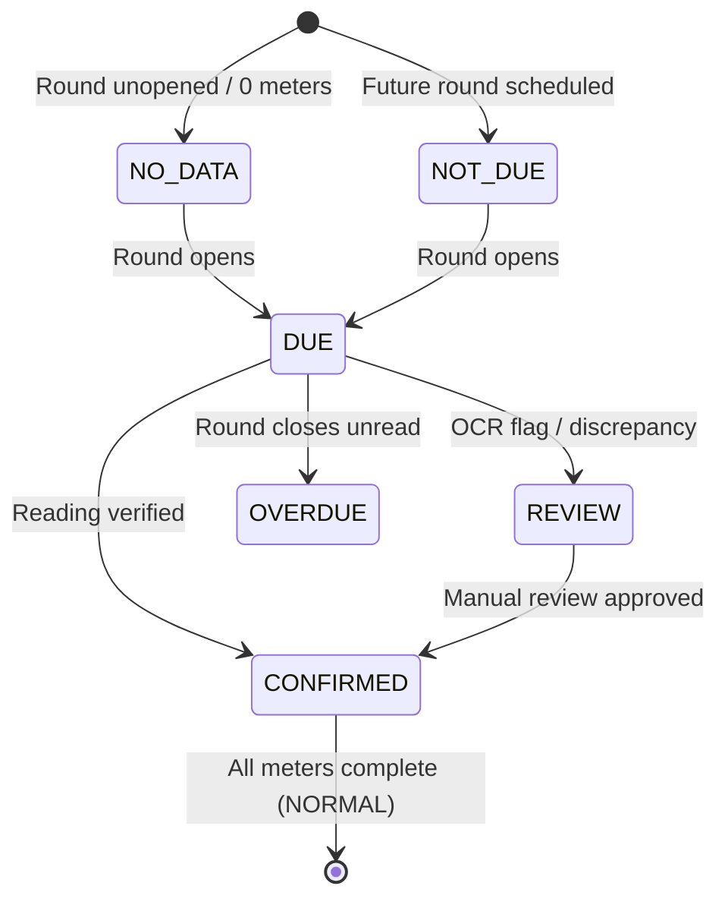

# Map V2 Final Architecture Reconciliation — 10. Final Entity Information Contract

**Thread:** 6 — Map V2 Final Architecture Reconciliation  
**Objective:** Define the authoritative Level 0 to Level 3 progressive disclosure contracts for all operational entities on Map V2.

---

## 1. Information Hierarchy Principles (L0 to L3)

In accordance with Maritime Operational Minimalism (`saigon-port-ui`):
- **L0 (At-a-Glance Canvas)**: Visual markers, boundary polygons, and high-priority status signals visible without user interaction.
- **L1 (Labeling Layer)**: Identifiers, zone titles, and high-level progress indicators.
- **L2 (Transient Hover / Focus)**: Quick preview tooltip (max 280px) appearing on mouseover or keyboard focus; dismisses immediately on blur.
- **L3 (Contextual Inspector Dock)**: Right-side docked inspection rail (320px–360px wide) providing deep-dive metrics, audit trails, and cross-screen navigation actions.

---

## 2. Entity Contract: Employee (Nhân sự tác nghiệp)

```text
┌────────────────────────────────────────────────────────┐
│ L0: 32×32px avatar marker anchored at zone center      │
├────────────────────────────────────────────────────────┤
│ L2 Hover: Mã NV · Họ tên · Khu vực phụ trách           │
│           (Cảnh báo mô phỏng nếu đang bật animation)   │
├────────────────────────────────────────────────────────┤
│ L3 Dock: Hồ sơ phân công · Tiến độ khu vực · Phân ca   │
└────────────────────────────────────────────────────────┘
```

| Level | Permitted Fields & Information | Strictly Prohibited Fields |
| :--- | :--- | :--- |
| **L0 Canvas** | 32×32px circular avatar with outlined navy border. Status dot indicates assignment (`🟢 Phụ trách chính`). | Animated path lines, fake pulsing radar rings, simulated GPS coordinate readouts. |
| **L1 Label** | Employee code (`NV001`) or short name (`Hải. NV`). | Fictional position status ("Đang di chuyển"). |
| **L2 Hover** | - Employee Code & Full Name (`NV001 — Nguyễn Văn Hải`)<br>- Zone Responsibility (`Khu cảng sà lan`)<br>- Assignment Role (`Phụ trách chính`)<br>- Verified Shift (only if `WorkSchedule` is verified)<br>- *Mandatory disclosure if animated*: `"Chuyển động minh họa (Demo)"` | **Personal progress rings** (e.g. `8/10 công tơ`), personal reading count, unverified attendance status, any GPS terminology. |
| **L3 Dock** | - Avatar + Full Name + Employee Code + Role<br>- Standing Zone Assignment details (`effective_from`)<br>- Verified Shift Schedule for today (if available in DB)<br>- Verified Attendance Check-in time (if checked in at wharf gate)<br>- **Zone-Level Progress** (explicitly labeled: *"Tiến độ khu vực: 34 / 42 công tơ"* — NOT personal progress)<br>- Deep link CTA: `[Xem trong Phân ca]` | Personal completion percentages, personal reading quotas, editing HR records (Map is not an HR admin console). |

---

## 3. Entity Contract: Operational Zone (Phân khu tác nghiệp)

```text
┌────────────────────────────────────────────────────────┐
│ L0: Polygon boundary + Center icon + Status color      │
├────────────────────────────────────────────────────────┤
│ L2 Hover: Tên khu · Số công tơ · Tiến độ lượt          │
├────────────────────────────────────────────────────────┤
│ L3 Dock: Tổng quan khu · Danh sách ngoại lệ · Báo cáo  │
└────────────────────────────────────────────────────────┘
```

| Level | Permitted Fields & Information | Strictly Prohibited Fields |
| :--- | :--- | :--- |
| **L0 Canvas** | Boundary linework, zone code badge (`CSL`, `BTH`, `CONT`), status color accent (Normal: muted; Review: amber; Overdue: coral; No-Data: gray). | Giant cluttered KPI cards floating over polygons, obscuring underlying berths and roadways. |
| **L1 Label** | Display Label (`Khu cảng sà lan`) + Compact Status Pill. | Unverified percentages when round is unopened. |
| **L2 Hover** | - Zone Name & Code (`Khu cảng sà lan — CSL`)<br>- Reading Round Progress: *"Đã ghi {confirmed} / {total} công tơ"*<br>- Attention Count: *"⚠️ {review} cần kiểm tra"* / *"🔴 {overdue} trễ hạn"*<br>- Target Round Status: *"Lượt 10:00 (Đang mở)"* | Fabricated child-zone aggregates; rendering `0%` when no data exists. |
| **L3 Dock** | - Zone Header (Name, Code, Operational Type, Description)<br>- Assigned Operator Summary (Avatar, Name, Code, Reassign CTA)<br>- Detailed Round Breakdown (Confirmed, Review, Overdue, Due, Pending)<br>- List of Meters Needing Attention in this Zone<br>- Deep link CTA: `[Xem Báo cáo khu vực]`, `[Xem trong Lịch ghi]` | Automatic parent-child double-counting; raw GIS vertex tables in operational mode. |

### Explicit Zone Operational States



---

## 4. Entity Contract: Meter (Công tơ điện / nước)

```text
┌────────────────────────────────────────────────────────┐
│ L0: Pin marker (⚡ Amber / 💧 Blue) + Semantic dot     │
├────────────────────────────────────────────────────────┤
│ L2 Hover: Mã công tơ · Số đọc gần nhất · Thời gian     │
├────────────────────────────────────────────────────────┤
│ L3 Dock: Chi tiết đo đếm · Hậu kiểm · Hồ sơ thiết bị   │
└────────────────────────────────────────────────────────┘
```

| Level | Permitted Fields & Information | Strictly Prohibited Fields |
| :--- | :--- | :--- |
| **L0 Canvas** | 16×16px circular marker with outlined utility icon (⚡ or 💧). Semantic halo/ring indicates state: Green (`CONFIRMED`), Amber (`REVIEW`), Red (`OVERDUE`), Blue (`DUE`), Gray (`PENDING`). | Giant floating labels, sci-fi glowing laser grids. |
| **L1 Label** | Meter Code (`CT-001`) visible at zoom levels > 2.0x. | Raw readings visible at port-wide zoom. |
| **L2 Hover** | - Meter Code & Name (`⚡ CT-001 · Trạm biến áp 1`)<br>- Location string (`Phía Đông bãi container`)<br>- Current Round Semantic State (`Đã ghi`, `Cần kiểm tra`, etc.)<br>- Latest Reading Value: Tabular raw number (e.g. `10452.8`)<br>- Latest Reading Time: `HH:mm · DD/MM` | Hardcoded unverified units (`kWh`, `m³`) due to `MEASUREMENT_UNIT_DATA_GAP`. |
| **L3 Dock** | - Header: Meter Code, Name, Utility Icon, Zone, Lifecycle Status<br>- Large Reading Hero Element: Tabular font 36px<br>- Confirmation Metadata: Submitter name, Server timestamp, Confirmation source (`OCR_CONFIRMED` / `USER_CORRECTED`)<br>- Exception details (if `REVIEW` or `OVERDUE`)<br>- Secondary OCR Diagnostics: Det confidence, OCR confidence (collapsed by default)<br>- Action CTAs: `[Kiểm tra ảnh chỉ số]` (opens modal), `[Xem hồ sơ thiết bị]` | Exposing PaddleOCR/YOLO internal weights; consumption delta charts without verified rollover rules. |

---

## 5. Technical Network & Simulated Infrastructure Boundary

To comply with Section 17.D:
1. **Strict Provenance Labeling**:
   - `VERIFIED`: Meters, physical substations, and survey-backed zone boundaries.
   - `SIMULATED`: B2 electrical feeders, distribution busbars, and water pipelines from `utilityDemoLayout.ts`.
2. **Permanent Simulation Disclosure**: When any simulated utility network layer is enabled, Map V2 must render an explicit watermark/pill in the header:
   ```text
   ⚠️ Mạng hạ tầng mô phỏng (tan-thuan-demo-v1) · Không dùng cho tác nghiệp kỹ thuật ngầm
   ```
3. **No Presentation as Ground Truth**: Never label simulated SVG lines as "Tuyến cáp ngầm thực tế" or "Vị trí van nước thực địa".

---

## 6. Exception-First Density Policy by Viewport Zoom

| Zoom Level | Visual Policy | Entities Rendered |
| :--- | :--- | :--- |
| **Port-Wide (< 1.0x)** | High-level spatial overview. Subdued normal zones; prominent exception badges. | Zone outlines, Zone code labels, Status badges, Standing assignees. **Individual meters hidden**. |
| **Zone View (1.0x–2.0x)** | Operational dispatch view. Focus on areas requiring intervention. | Zone names, Assignees, Priority exception meters (`REVIEW` and `OVERDUE`). Normal meters shown as small neutral dots. |
| **Meter Close-up (> 2.0x)** | Precision meter inspection. | All meters fully rendered with utility icons, meter codes, and semantic halos. Utility feeder linework enabled. |
