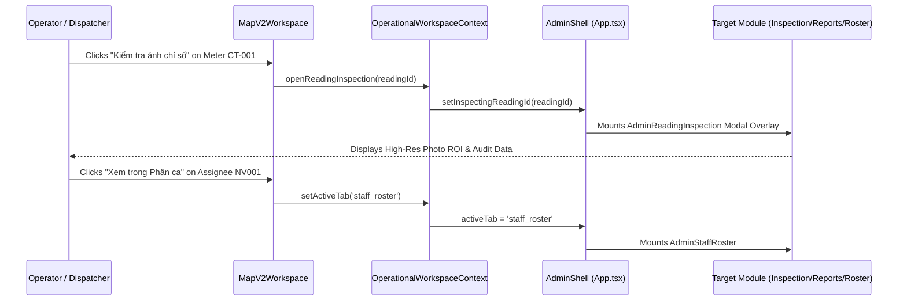

# Map V2 Final Architecture Reconciliation — 11. Cross-Screen Integration & Navigation Workflows

**Thread:** 6 — Map V2 Final Architecture Reconciliation  
**Objective:** Reconcile navigation flows between Map V2, Schedules, Staff Roster, Reports, and Reading Inspection, maximizing reuse of `OperationalWorkspaceContext`.

---

## 1. Architectural Reusability Analysis

Rather than creating new routing mechanisms, URL hashes, or standalone event buses, all cross-screen navigation can be driven cleanly through the methods already implemented in [`OperationalWorkspaceContext.tsx`](file:///D:/Projects/production-meter-reading/production-meter-reading/frontend/src/context/OperationalWorkspaceContext.tsx#L86-L165):



---

## 2. Cross-Screen Workflow Audit Matrix

| Workflow | Direction | Status | Reusable Context Mechanism | Missing Link / Action Required |
| :--- | :---: | :---: | :--- | :--- |
| **Meter ➔ Reading Inspection** | Map ➔ Inspection | **`CURRENTLY_WORKING`** | `openReadingInspection(readingId)` | Map V2 simply needs to call `openReadingInspection(meter.reading_id)` from its inspector CTA. Modal is already mounted at `App.tsx#L173`. |
| **Meter ➔ Assets / Devices** | Map ➔ Assets | **`MISSING_FRONTEND_WIRING`** | `openMeterDetails(meterId, meterCode)` | Calls `openMeterDetails()`, which sets `deviceSegment = 'METERS'` and `activeTab = 'assets'`. |
| **Zone ➔ Reports** | Map ➔ Reports | **`MISSING_FRONTEND_WIRING`** | `setActiveTab('reports')` | Navigates to Reports. `AdminReports` currently uses local state for `selectedLocation`; needs to accept initial filter from `focusedEntity.name` or `zoneId`. |
| **Zone ➔ Schedules** | Map ➔ Schedules | **`MISSING_FRONTEND_WIRING`** | `setActiveTab('schedules')` | Navigates to Schedules tab with `selectedDate` and `selectedRoundId` already shared via context. |
| **Employee ➔ Staff Roster** | Map ➔ Roster | **`MISSING_FRONTEND_WIRING`** | `setActiveTab('staff_roster')` | Navigates to Staff Roster. To highlight the specific employee, `AdminStaffRoster` can inspect `focusedEntity.id`. |
| **Schedules ➔ Map** | Schedules ➔ Map | **`PARTIAL`** | `locateOnMap(entity)` | `AdminSchedules` can call `locateOnMap()`. Currently `locateOnMap` routes to `'dashboard'` (Map V1); should route to `'map_v2'`. |
| **Reports ➔ Map** | Reports ➔ Map | **`PARTIAL`** | `locateOnMap(entity)` | Reports table items can trigger `locateOnMap({ type: 'meter', id, code, coordinates })`. |
| **Meter ➔ Verification** | Map ➔ Hậu kiểm | **`MISSING_FRONTEND_WIRING`** | `openVerification(assetId)` | Navigates to `verification` tab for review-flagged readings. |

---

## 3. Special Reconciliation: `locateOnMap()` Destination

In [`frontend/src/context/OperationalWorkspaceContext.tsx#L93-L97`](file:///D:/Projects/production-meter-reading/production-meter-reading/frontend/src/context/OperationalWorkspaceContext.tsx#L93):

```typescript
const locateOnMap = useCallback((entity: FocusedEntity) => {
  setFocusedEntity(entity);
  setInspectingReadingId(null);
  setActiveTab('dashboard'); // <-- Hardcoded to Map V1
}, [setActiveTab]);
```

### Analysis
- Previously, `activeTab = 'dashboard'` rendered `AdminDashboard.tsx`, which hosted Map V1 (`MapOperationsPage.tsx`).
- Map V2 is mounted at `activeTab = 'map_v2'`.
- Calling `locateOnMap()` from other screens currently routes to Map V1.

### Target-State Recommendation
During Phase A implementation:
1. Update `locateOnMap` in `OperationalWorkspaceContext.tsx` to set `setActiveTab('map_v2')`.
2. In `MapV2Workspace.tsx`, subscribe to `focusedEntity`:
   - When `focusedEntity` changes, parse `focusedEntity.coordinates` or look up `meter_code`/`zoneId`.
   - Call `cameraService.panTo()` to smoothly frame the entity and set `selectedEntity`.

---

## 4. Reporting Dependency Boundary

In accordance with Section 14:
> *"Do not redesign Reports in this thread. However, identify which Map inspector actions depend on the Reporting audit. Classify: `SAFE_NAVIGATION_NOW`, `REPORTING_CONTRACT_REQUIRED`, `CONSUMPTION_RULE_REQUIRED`, `NOT_SUPPORTED`."*

| Action / Capability | Classification | Backend Readiness | Rationale |
| :--- | :---: | :---: | :--- |
| **"Xem Báo cáo khu vực"** | **`SAFE_NAVIGATION_NOW`** | Ready | Simple tab navigation to `AdminReports` with location filter. |
| **"Xem Báo cáo công tơ"** | **`SAFE_NAVIGATION_NOW`** | Ready | Navigates to `AdminReports` SubTab `meters` filtered by meter code. |
| **"Xem lịch sử chỉ số"** | **`SAFE_NAVIGATION_NOW`** | Ready (`GET /api/v1/admin/technical-reports/meters/{id}/details`) | Returns array of historical readings (`server_timestamp`, `reading`, `status`, `employee_code`). |
| **"Tiêu thụ sản lượng 3–5 kỳ"** | **`CONSUMPTION_RULE_REQUIRED`** | **Blocked by Missing Rules** | Cumulative dial readings $\ne$ period consumption. Without business rules for meter rollover (e.g. `99999` ➔ `00005`), meter replacement, and transformation multipliers, calculating deltas will produce erroneous billing numbers. |
| **"Biểu đồ xu hướng sản lượng"** | **`CONSUMPTION_RULE_REQUIRED`** | **Blocked by Missing Rules** | Same as above. Do not plot consumption deltas until the consumption rule contract is formalized. |
| **"Xuất Excel sản lượng theo khu"** | **`REPORTING_CONTRACT_REQUIRED`** | Ready in Reports (`getAdminTechnicalExportUrl`) | Action should delegate directly to Reports export, not implement custom export inside Map V2. |
